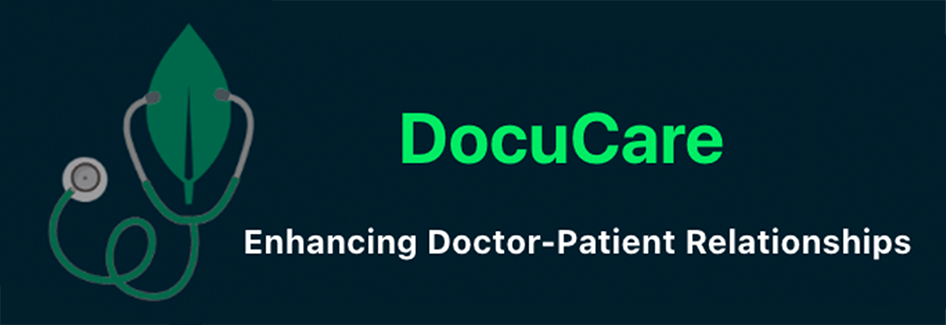
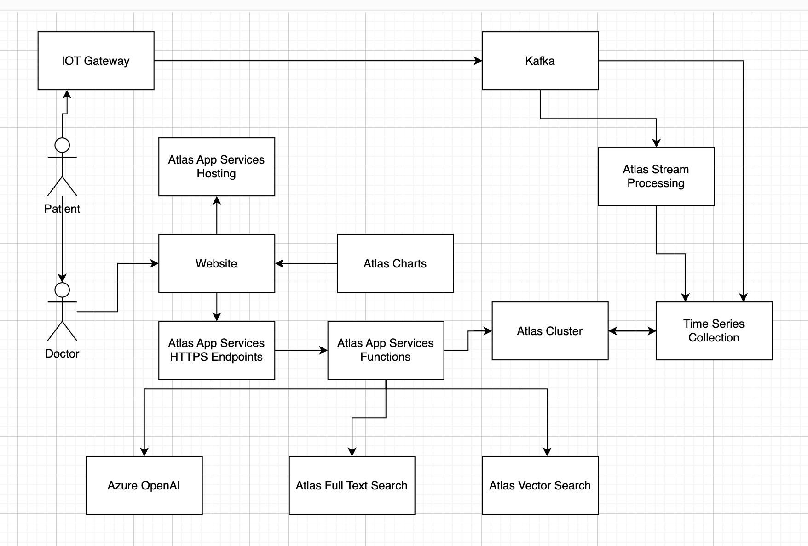

# Details

**Project** : Docucare 
**Team Number** : _insert team number here_  
**Team Name** : _insert team name here_  
**Demonstration Video** : _Insert link to demonstration video_  

# Overview

DocuCare, trademark pending, is a Doctor-Patient Platform that transforms recorded medical information into concise summaries and actionable insights for both doctors and patients. Doctors can analyze similar symptoms across patients, while patients can ask follow-up questions based on their history, fostering efficient and informed healthcare communication. DocuCare aims to enhance the doctor-patient relationship through intelligent data utilization.

# Justification
 
_Please explain why you decided to build the application/demonstration for this project. What inspired you? What problems does it solve or how will it make Presales activities easier?_

Just like Docucare shows, MongoDB’s developer data platform allows organizations to integrates all of the data services you need to build modern applications in a unified developer experience. It handles transactional workloads, full-text search, AI-enhanced experiences, stream data processing, and more, all while reducing data infrastructure sprawl and complexity!

# Detailed Application Overview

_Describe the architecture of your application and include a diagram._
Docucare uses a majority of Atlas components to achieve enhanced communication. Upon logging in, the doctor view is presented with a list of patients and a search bar all facilitated by App services HTTP endpoints and functions. A search bar powered by Atlas search for any mistakes (fuzzy matching) and autocomplete features to make our doctor's life easier. 

Once in a single patient view, the doctor has an overall view of the patient together with an AI generated summary covering his previous visits, any current medication, diagnosis etc. If the patient has wearable devices, charts with continous vitals are also presented for the doctor to evaluate. The doctor then has a notepad to take notes during a visit, whereby we have combined AI to summarize the notes, but also in conjunction with our knowledge base using vector search to come up with potential conversational key topics to discuss as they work together towards a diagnosis. All this happens instantaneously using our app services. At the end of a session, a potential diagnosis and treatment option is presented as a potential path forward for the patient.

Docucare uses the following components:

* Atlas Database
* Atlas Full Text Search
* Atlas Vector Search
* Atlas App Services (functions, HTTP Endpoints)
* Azure OpenAI
* Kafka, Atlas Stream Processing and Time Series

_Describe what you application does and how it works_

# Roles and Responsibilities

_List all the team members and summarize the contributions each member made to this project_

# Demonstration Script

_Demonstration script (or link to script) goes here_

_The demonstration script should provide all the information required for another MongoDB SA to deliver your demonstration to a prospect. This should include:_

* _setup/installation steps_
* _step by step instructions on how to give the demonstration_
* _key points to emphasize at each point in the demonstration_
* _any tear down steps required to reset the demonstration so it is ready for the next time_
